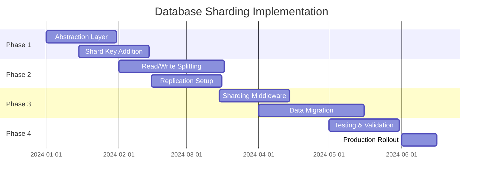

# ERP System Database Sharding Strategy
## 資料庫分片策略文件

---

## Executive Summary | 執行摘要

This document outlines the database sharding strategy for the ERP system to ensure scalability as data volume and transaction load increase. The strategy provides a roadmap for transitioning from a single PostgreSQL instance to a distributed database architecture while maintaining data consistency and system performance.

本文件概述了ERP系統的資料庫分片策略，以確保隨著資料量和交易負載增加時的可擴展性。該策略提供了從單一PostgreSQL實例過渡到分散式資料庫架構的路線圖，同時維持資料一致性和系統性能。

---

## Current State Analysis | 現況分析

### Database Statistics
```sql
-- Current Data Distribution (Estimated)
├── Users: ~1,000 records
├── Suppliers: ~500 records  
├── Requisitions: ~10,000 records/year
├── Purchase Orders: ~5,000 records/year
├── Inventory Items: ~50,000 records
├── Transactions: ~100,000 records/year
└── Audit Logs: ~500,000 records/year
```

### Growth Projections
- **Year 1**: 1GB total data
- **Year 3**: 10GB total data
- **Year 5**: 100GB total data
- **Transaction Rate**: 100 TPS → 1,000 TPS by Year 5

---

## Sharding Strategy | 分片策略

### 1. Sharding Architecture

```
┌─────────────────────────────────────────┐
│         Application Layer               │
├─────────────────────────────────────────┤
│         Sharding Middleware             │
│    (Vitess / Citus / Custom Router)     │
├─────────────────────────────────────────┤
│         Database Shards                 │
├────────┬────────┬────────┬──────────────┤
│ Shard 1│ Shard 2│ Shard 3│   Config DB  │
│  (A-H) │  (I-P) │  (Q-Z) │   (Global)   │
└────────┴────────┴────────┴──────────────┘
```

### 2. Sharding Dimensions

#### A. Horizontal Sharding (Recommended)
```yaml
Primary Shard Key: company_id or tenant_id (for multi-tenant future)
Secondary Shard Key: created_at (for time-based partitioning)

Shard Distribution:
  - Shard 1: Companies A-H / Date Range 2024-2025
  - Shard 2: Companies I-P / Date Range 2024-2025
  - Shard 3: Companies Q-Z / Date Range 2024-2025
  - Archive Shards: Historical data older than 2 years
```

#### B. Functional Sharding
```yaml
Shard by Business Domain:
  - Shard A: Requisitions & Approvals
  - Shard B: Purchase Orders & Suppliers
  - Shard C: Inventory & Warehousing
  - Shard D: Accounting & Financial
  - Shard E: Audit Logs & Reports
```

---

## Implementation Phases | 實施階段

### Phase 1: Preparation (Month 1-2)
```yaml
Tasks:
  - Implement database abstraction layer
  - Add shard_key to all relevant tables
  - Create data migration scripts
  - Set up replication for testing

Code Changes:
  - Add shard-aware ORM layer
  - Implement cross-shard query handler
  - Update connection pooling
```

### Phase 2: Vertical Partitioning (Month 3-4)
```yaml
Separate by Read/Write:
  - Master DB: All writes
  - Replica DB 1: Reporting queries
  - Replica DB 2: Read-heavy operations

Implementation:
  - Set up PostgreSQL streaming replication
  - Implement read/write splitting in application
  - Add connection routing logic
```

### Phase 3: Horizontal Sharding (Month 5-6)
```yaml
Initial Sharding:
  - Deploy sharding middleware (Vitess/Citus)
  - Migrate data to shards
  - Update application routing
  - Test cross-shard operations

Shard Distribution:
  - Active Data: Last 2 years (3 shards)
  - Archive Data: Older than 2 years (1 shard)
  - Reference Data: Replicated to all shards
```

---

## Sharding Rules & Patterns | 分片規則與模式

### 1. Data Distribution Rules

```python
# Shard Key Selection Algorithm
def get_shard_key(entity_type, entity_data):
    if entity_type == 'requisition':
        return hash(entity_data['company_id']) % NUM_SHARDS
    elif entity_type == 'purchase_order':
        return hash(entity_data['supplier_id']) % NUM_SHARDS
    elif entity_type == 'inventory':
        return hash(entity_data['warehouse_id']) % NUM_SHARDS
    else:
        return 0  # Default to primary shard
```

### 2. Cross-Shard Queries

```sql
-- Denormalized View for Cross-Shard Queries
CREATE MATERIALIZED VIEW global_requisition_summary AS
SELECT 
    shard_id,
    requisition_id,
    company_id,
    total_amount,
    status,
    created_at
FROM all_shards.requisitions
REFRESH EVERY 1 HOUR;
```

### 3. Reference Data Replication

```yaml
Replicated Tables (All Shards):
  - users
  - suppliers
  - item_categories
  - system_settings
  - currency_rates

Sharded Tables:
  - requisitions
  - purchase_orders
  - inventory_items
  - transactions
  - audit_logs
```

---

## Data Consistency Strategy | 資料一致性策略

### 1. Transaction Management

```python
# Two-Phase Commit for Cross-Shard Transactions
class ShardedTransactionManager:
    def execute_cross_shard_transaction(self, operations):
        # Phase 1: Prepare
        prepared_shards = []
        for shard_id, operation in operations:
            if shard.prepare(operation):
                prepared_shards.append(shard_id)
            else:
                self.rollback_all(prepared_shards)
                raise TransactionError()
        
        # Phase 2: Commit
        for shard_id in prepared_shards:
            shard.commit()
```

### 2. Eventual Consistency

```yaml
Async Replication Strategy:
  - Critical Data: Synchronous replication
  - Analytics Data: Async replication (5-minute lag acceptable)
  - Audit Logs: Async batch replication (hourly)
  
Conflict Resolution:
  - Last-Write-Wins for non-critical data
  - Version vectors for critical data
  - Manual resolution for financial data
```

---

## Performance Optimization | 性能優化

### 1. Query Routing

```python
class SmartQueryRouter:
    def route_query(self, query_type, params):
        if query_type == 'aggregate_report':
            return self.route_to_analytics_shard()
        elif query_type == 'real_time_lookup':
            return self.route_to_primary_shard(params['shard_key'])
        elif query_type == 'historical_query':
            return self.route_to_archive_shard()
        else:
            return self.route_by_shard_key(params)
```

### 2. Caching Strategy

```yaml
Multi-Level Cache:
  L1 Cache (Application): 
    - User sessions
    - Frequently accessed reference data
    - TTL: 5 minutes
    
  L2 Cache (Redis Cluster):
    - Cross-shard aggregations
    - Denormalized views
    - TTL: 1 hour
    
  L3 Cache (Database):
    - Materialized views
    - Pre-computed reports
    - TTL: Daily refresh
```

### 3. Index Strategy per Shard

```sql
-- Shard-Specific Indexes
-- Requisition Shard
CREATE INDEX idx_req_company_date ON requisitions(company_id, created_at);
CREATE INDEX idx_req_status ON requisitions(status) WHERE status IN ('pending', 'approved');

-- Purchase Order Shard  
CREATE INDEX idx_po_supplier ON purchase_orders(supplier_id, order_date);
CREATE INDEX idx_po_amount ON purchase_orders(total_amount) WHERE total_amount > 10000;

-- Inventory Shard
CREATE INDEX idx_inv_location ON inventory_items(warehouse_id, zone_id, shelf_id);
CREATE INDEX idx_inv_quantity ON inventory_items(item_id, quantity) WHERE quantity > 0;
```

---

## Monitoring & Maintenance | 監控與維護

### 1. Shard Health Monitoring

```yaml
Metrics to Track:
  - Shard size distribution (should be within 20% of each other)
  - Query distribution across shards
  - Cross-shard query frequency
  - Replication lag
  - Connection pool utilization
  
Alerts:
  - Shard imbalance > 30%
  - Replication lag > 5 minutes
  - Cross-shard queries > 20% of total
  - Failed shard detection
```

### 2. Rebalancing Strategy

```python
# Automatic Shard Rebalancing
class ShardRebalancer:
    def check_balance(self):
        shard_sizes = self.get_shard_sizes()
        avg_size = sum(shard_sizes) / len(shard_sizes)
        
        for shard_id, size in enumerate(shard_sizes):
            if abs(size - avg_size) / avg_size > 0.3:  # 30% threshold
                self.trigger_rebalance(shard_id)
    
    def trigger_rebalance(self, overloaded_shard):
        # Move data to underutilized shards
        target_shard = self.find_underutilized_shard()
        self.migrate_data(overloaded_shard, target_shard)
```

---

## Disaster Recovery | 災難復原

### 1. Backup Strategy

```yaml
Backup Schedule:
  - Full Backup: Weekly (all shards)
  - Incremental: Daily
  - Transaction Logs: Continuous (5-minute intervals)
  
Backup Storage:
  - Primary: Local SSD (fast recovery)
  - Secondary: Cloud Storage (long-term)
  - Tertiary: Off-site tape (compliance)
```

### 2. Failover Procedures

```yaml
Automatic Failover:
  Detection Time: < 30 seconds
  Failover Time: < 2 minutes
  RPO (Recovery Point Objective): < 5 minutes
  RTO (Recovery Time Objective): < 15 minutes

Manual Procedures:
  1. Detect failed shard
  2. Promote replica to master
  3. Update shard routing table
  4. Redirect traffic
  5. Verify data consistency
  6. Rebuild failed shard
```

---

## Migration Roadmap | 遷移路線圖

### Timeline



---

## Cost-Benefit Analysis | 成本效益分析

### Costs
- **Infrastructure**: $50,000 (additional servers, storage)
- **Software Licenses**: $20,000 (sharding middleware)
- **Development**: 6 person-months
- **Training**: $5,000
- **Total**: ~$150,000

### Benefits
- **Scalability**: Support 10x user growth
- **Performance**: 50% query speed improvement
- **Availability**: 99.99% uptime (from 99.9%)
- **Cost Savings**: 30% reduction in per-transaction cost at scale

### ROI
- **Break-even**: 18 months
- **5-year savings**: $500,000

---

## Conclusion | 結論

The sharding strategy provides a clear path for scaling the ERP database from its current single-instance architecture to a distributed system capable of handling enterprise-level loads. The phased approach minimizes risk while providing immediate benefits through read/write splitting and vertical partitioning.

分片策略為ERP資料庫從當前的單實例架構擴展到能夠處理企業級負載的分散式系統提供了明確的路徑。分階段的方法通過讀寫分離和垂直分區提供即時效益，同時將風險降至最低。

---

## Appendix | 附錄

### A. Shard Key Selection Matrix

| Entity Type | Primary Shard Key | Secondary Key | Distribution Method |
|-------------|-------------------|---------------|---------------------|
| Requisition | company_id | created_at | Hash + Range |
| Purchase Order | supplier_id | order_date | Hash + Range |
| Inventory | warehouse_id | item_category | Hash + Hash |
| Transaction | account_id | transaction_date | Hash + Range |
| Audit Log | module_id | timestamp | Hash + Range |

### B. Technology Comparison

| Solution | Pros | Cons | Recommendation |
|----------|------|------|----------------|
| Vitess | Battle-tested, MySQL compatible | Learning curve | ⭐⭐⭐⭐ |
| Citus | PostgreSQL native | Commercial | ⭐⭐⭐⭐⭐ |
| Custom | Full control | Maintenance burden | ⭐⭐ |
| YugabyteDB | Built-in sharding | New technology | ⭐⭐⭐ |

### C. Query Rewrite Examples

```sql
-- Original Query
SELECT * FROM requisitions WHERE status = 'approved';

-- Sharded Query
SELECT * FROM shard_1.requisitions WHERE status = 'approved'
UNION ALL
SELECT * FROM shard_2.requisitions WHERE status = 'approved'
UNION ALL
SELECT * FROM shard_3.requisitions WHERE status = 'approved';

-- With Routing Logic
EXECUTE FUNCTION route_query('requisitions', 'status', 'approved');
```

---

*Document Version: 1.0*  
*Last Updated: September 2025*  
*Prepared by: System Architect*