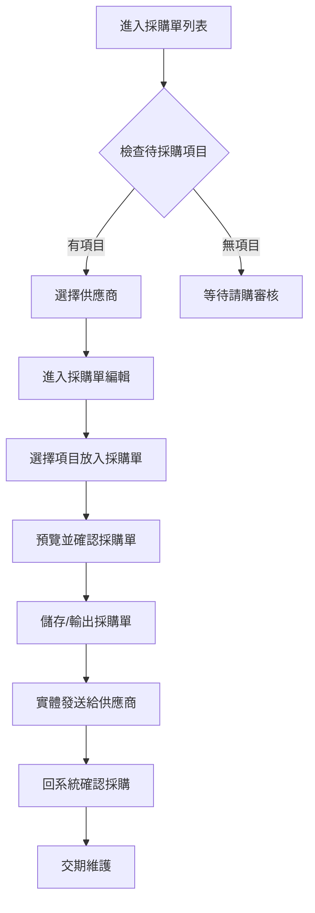

# ERP 採購系統前端規格書 - UX 設計規範

## 📋 目錄
1. [系統概覽](#系統概覽)
2. [用戶旅程地圖](#用戶旅程地圖)  
3. [頁面設計規格](#頁面設計規格)
4. [響應式設計策略](#響應式設計策略)
5. [組件庫使用指南](#組件庫使用指南)
6. [互動設計模式](#互動設計模式)
7. [無障礙設計規範](#無障礙設計規範)

---

## 系統概覽

### 核心業務流程
1. **請購審核** → 2. **採購單製作** → 3. **採購確認** → 4. **交期維護** → 5. **到貨驗收**

### 用戶角色與權限
- **請購人員**: 提交請購單、查看物流狀態
- **採購人員**: 審核請購、製作採購單、維護交期
- **採購主管**: 最終確認採購、權限管理

---

## 用戶旅程地圖

### 採購人員核心工作流程



---

## 頁面設計規格

## 1. 採購單列表頁面 (PO List Page)

### 頁面結構
```
┌─────────────────────────────────────┐
│ 📋 採購單建立 - 供應商分組           │
├─────────────────────────────────────┤
│ [篩選器] [重新整理] [全部建立]      │
├─────────────────────────────────────┤
│ 📦 供應商A (5項待採購)             │
│ ├ 總金額: NT$12,500               │
│ └ [進入編輯] [快速建立]            │
├─────────────────────────────────────┤
│ 📦 供應商B (3項待採購)             │
│ ├ 總金額: NT$8,900                │
│ └ [進入編輯] [快速建立]            │
└─────────────────────────────────────┘
```

### Vue 組件設計
```vue
<template>
  <div class="po-list-page">
    <!-- 頁面標題與控制項 -->
    <PageHeader
      title="採購單建立"
      subtitle="依供應商分組的待採購項目"
      :show-refresh="true"
      @refresh="handleRefresh"
    />

    <!-- 操作工具列 -->
    <div class="toolbar">
      <el-row :gutter="16" justify="space-between">
        <el-col :span="12">
          <el-input
            v-model="searchKeyword"
            placeholder="搜尋供應商名稱..."
            clearable
            @input="handleSearch"
          >
            <template #prefix>
              <el-icon><Search /></el-icon>
            </template>
          </el-input>
        </el-col>
        <el-col :span="12" class="text-right">
          <el-button 
            type="success" 
            @click="createAllPOs"
            :disabled="!hasAvailableSuppliers"
          >
            <el-icon><DocumentAdd /></el-icon>
            批量建立全部採購單
          </el-button>
        </el-col>
      </el-row>
    </div>

    <!-- 供應商卡片列表 -->
    <div v-if="loading" class="loading-container">
      <el-skeleton :rows="6" animated />
    </div>

    <div v-else-if="supplierGroups.length === 0" class="empty-state">
      <el-empty description="暫無待採購項目">
        <template #image>
          <el-icon size="60"><Box /></el-icon>
        </template>
        <el-button type="primary" @click="$router.push('/requisitions')">
          前往請購管理
        </el-button>
      </el-empty>
    </div>

    <div v-else class="supplier-cards">
      <el-card 
        v-for="supplier in filteredSuppliers" 
        :key="supplier.supplier_id"
        class="supplier-card"
        shadow="hover"
      >
        <template #header>
          <div class="supplier-header">
            <div class="supplier-info">
              <div class="supplier-name">
                <h3>{{ supplier.supplier_name_zh }}</h3>
                <el-tag 
                  :type="getSupplierTypeTag(supplier.region)"
                  size="small"
                >
                  {{ supplier.region === 'domestic' ? '國內' : '海外' }}
                </el-tag>
              </div>
              <div class="supplier-meta">
                <el-tag type="info" class="item-count">
                  <el-icon><List /></el-icon>
                  {{ supplier.items.length }} 項待採購
                </el-tag>
                <el-tag type="success" class="total-amount">
                  <el-icon><Money /></el-icon>
                  總額 {{ formatCurrency(supplier.totalAmount) }}
                </el-tag>
              </div>
            </div>
            <div class="supplier-actions">
              <el-button 
                type="primary" 
                @click="enterPOEditor(supplier)"
                :loading="loadingSuppliers.has(supplier.supplier_id)"
              >
                進入編輯
              </el-button>
              <el-button 
                type="success" 
                plain
                @click="quickCreatePO(supplier)"
                :loading="creatingPOs.has(supplier.supplier_id)"
              >
                快速建立
              </el-button>
            </div>
          </div>
        </template>

        <!-- 項目預覽表格 -->
        <el-table 
          :data="supplier.items.slice(0, 3)" 
          size="small"
          :show-header="false"
        >
          <el-table-column width="40">
            <template #default="{ $index }">
              <span class="item-index">{{ $index + 1 }}</span>
            </template>
          </el-table-column>
          <el-table-column>
            <template #default="{ row }">
              <div class="item-preview">
                <div class="item-name">{{ row.item_name }}</div>
                <div class="item-spec">{{ row.item_specification }}</div>
              </div>
            </template>
          </el-table-column>
          <el-table-column width="80" align="right">
            <template #default="{ row }">
              <div class="item-quantity">
                <span>{{ row.item_quantity }}</span>
                <small>{{ row.item_unit }}</small>
              </div>
            </template>
          </el-table-column>
          <el-table-column width="100" align="right">
            <template #default="{ row }">
              <span class="money-text">
                {{ formatCurrency(row.unit_price * row.item_quantity) }}
              </span>
            </template>
          </el-table-column>
        </el-table>

        <!-- 更多項目指示器 -->
        <div v-if="supplier.items.length > 3" class="more-items">
          <el-divider>
            <el-tag type="info" size="small">
              還有 {{ supplier.items.length - 3 }} 項...
            </el-tag>
          </el-divider>
        </div>
      </el-card>
    </div>
  </div>
</template>
```

### Element Plus 組件配置
- **el-card**: shadow="hover" 提供互動回饋
- **el-tag**: 不同type區分國內外供應商 
- **el-button**: 主要操作用primary，次要操作用plain
- **el-table**: size="small" 節省空間，:show-header="false" 簡化預覽

---

## 2. 採購單編輯頁面 (PO Editor Page) - 重點設計

### 左右分欄佈局結構
```
┌────────────────┬────────────────────────────┐
│ 左側 (40%)     │ 右側 (60%)                 │
│ 待採購項目清單 │ 採購單即時預覽             │
│                │                            │
│ ☑ 項目A        │ ┌─ 採購單預覽 ─────────┐   │
│ ☐ 項目B        │ │ 供應商: 新亞洲        │   │
│ ☑ 項目C        │ │ 採購單號: PO2025...   │   │
│                │ │                       │   │
│ [放入採購單]   │ │ 項目清單              │   │
│ [全選/取消]    │ │ 1. 項目A  NT$1,200    │   │
│                │ │ 3. 項目C  NT$800      │   │
│                │ │                       │   │
│                │ │ 小計: NT$2,000        │   │
│                │ │ 稅額: NT$100.0        │   │  
│                │ │ 總計: NT$2,100        │   │
│                │ └───────────────────────┘   │
└────────────────┴────────────────────────────┘
```

### Vue 組件設計
```vue
<template>
  <div class="po-editor-page">
    <PageHeader
      :title="`編輯採購單 - ${supplierInfo?.supplier_name_zh}`"
      subtitle="選擇項目建立採購單"
      :show-back="true"
      @back="handleBack"
    />

    <div class="editor-container">
      <!-- 左側: 項目選擇區 -->
      <div class="items-selector">
        <div class="selector-header">
          <h4>待採購項目清單</h4>
          <div class="batch-controls">
            <el-button 
              size="small" 
              @click="selectAll"
              :disabled="selectedItems.size === availableItems.length"
            >
              全選
            </el-button>
            <el-button 
              size="small" 
              @click="clearSelection"
              :disabled="selectedItems.size === 0"
            >
              清空
            </el-button>
          </div>
        </div>

        <!-- 項目篩選與搜尋 -->
        <div class="selector-filters">
          <el-input
            v-model="itemSearchKeyword"
            placeholder="搜尋項目名稱或規格..."
            clearable
            size="small"
          >
            <template #prefix>
              <el-icon><Search /></el-icon>
            </template>
          </el-input>
        </div>

        <!-- 項目列表 -->
        <div class="items-list">
          <div
            v-for="item in filteredItems"
            :key="item.detail_id"
            class="item-row"
            :class="{ 'selected': selectedItems.has(item.detail_id) }"
            @click="toggleItem(item)"
          >
            <el-checkbox
              :model-value="selectedItems.has(item.detail_id)"
              @change="toggleItem(item)"
              @click.stop
            />
            
            <div class="item-content">
              <div class="item-main">
                <div class="item-name">{{ item.item_name }}</div>
                <div class="item-spec">{{ item.item_specification }}</div>
              </div>
              
              <div class="item-details">
                <div class="quantity-info">
                  <span class="quantity">{{ item.item_quantity }}</span>
                  <span class="unit">{{ item.item_unit }}</span>
                </div>
                <div class="price-info">
                  <div class="unit-price">
                    單價: {{ formatCurrency(item.unit_price) }}
                  </div>
                  <div class="subtotal">
                    小計: {{ formatCurrency(calculateItemSubtotal(item)) }}
                  </div>
                </div>
              </div>
              
              <div class="item-meta">
                <el-tag size="small" type="info">
                  {{ item.source_request_order_no }}
                </el-tag>
              </div>
            </div>
          </div>
        </div>

        <!-- 操作按鈕 -->
        <div class="selector-actions">
          <el-button
            type="primary"
            size="large"
            @click="addSelectedToPO"
            :disabled="selectedItems.size === 0"
            :loading="addingItems"
          >
            <el-icon><Plus /></el-icon>
            放入採購單 ({{ selectedItems.size }})
          </el-button>
        </div>
      </div>

      <!-- 右側: 採購單預覽區 -->
      <div class="po-preview">
        <div class="preview-header">
          <h4>採購單預覽</h4>
          <div class="preview-controls">
            <el-button 
              size="small" 
              type="danger"
              plain
              @click="clearPO"
              :disabled="poItems.length === 0"
            >
              清空採購單
            </el-button>
          </div>
        </div>

        <!-- 採購單內容預覽 -->
        <div v-if="poItems.length === 0" class="empty-preview">
          <el-empty description="尚未選擇任何項目" :image-size="80">
            <template #image>
              <el-icon size="80"><Document /></el-icon>
            </template>
          </el-empty>
        </div>

        <div v-else class="po-document">
          <!-- 採購單表頭 -->
          <div class="po-header">
            <div class="company-logo">
              <h2>採購單</h2>
            </div>
            <div class="po-number">
              <strong>採購單號: {{ generatedPONumber }}</strong>
            </div>
          </div>

          <!-- 供應商資訊區塊 -->
          <div class="supplier-section">
            <div class="section-title">供應商資訊</div>
            <el-row :gutter="20">
              <el-col :span="12">
                <div class="info-item">
                  <label>廠商名稱:</label>
                  <span>{{ supplierInfo?.supplier_name_zh }}</span>
                </div>
                <div class="info-item">
                  <label>廠商編號:</label>
                  <span>{{ supplierInfo?.supplier_code }}</span>
                </div>
                <div class="info-item">
                  <label>聯絡人:</label>
                  <span>{{ supplierInfo?.contact_person || '待確認' }}</span>
                </div>
              </el-col>
              <el-col :span="12">
                <div class="info-item">
                  <label>廠商地址:</label>
                  <span>{{ supplierInfo?.supplier_address }}</span>
                </div>
                <div class="info-item">
                  <label>連絡電話:</label>
                  <span>{{ supplierInfo?.contact_phone || '待確認' }}</span>
                </div>
                <div class="info-item">
                  <label>訂購日期:</label>
                  <span>{{ formatDate(new Date()) }}</span>
                </div>
              </el-col>
            </el-row>
          </div>

          <!-- 採購明細表格 -->
          <div class="items-section">
            <div class="section-title">採購明細</div>
            <el-table 
              :data="poItems" 
              border 
              :summary-method="getSummaries"
              show-summary
              class="po-table"
            >
              <el-table-column type="index" label="項目" width="60" align="center" />
              <el-table-column label="產品型號" prop="item_code" width="120" />
              <el-table-column label="名稱" prop="item_name" min-width="150" />
              <el-table-column label="規格" prop="item_specification" min-width="120" />
              <el-table-column label="數量" prop="item_quantity" width="80" align="center" />
              <el-table-column label="單位" prop="item_unit" width="60" align="center" />
              <el-table-column label="單價" width="100" align="right">
                <template #default="{ row }">
                  <span class="money-text">{{ formatCurrency(row.unit_price) }}</span>
                </template>
              </el-table-column>
              <el-table-column label="金額" width="120" align="right">
                <template #default="{ row }">
                  <span class="money-text">{{ formatCurrency(calculateItemSubtotal(row)) }}</span>
                </template>
              </el-table-column>
              <el-table-column label="操作" width="80" align="center">
                <template #default="{ row }">
                  <el-button
                    type="danger"
                    size="small"
                    text
                    @click="removeFromPO(row)"
                  >
                    移除
                  </el-button>
                </template>
              </el-table-column>
            </el-table>
          </div>

          <!-- 金額計算區塊 -->
          <div class="amount-section">
            <el-row justify="end">
              <el-col :span="8">
                <div class="amount-breakdown">
                  <div class="amount-item">
                    <label>未稅金額(NTD):</label>
                    <span class="money-large">{{ formatCurrency(subtotalAmount) }}</span>
                  </div>
                  <div class="amount-item tax-item">
                    <label>稅金5%:</label>
                    <span class="money-large">{{ formatCurrency(taxAmount, true) }}</span>
                  </div>
                  <el-divider />
                  <div class="amount-item total-item">
                    <label>合計:</label>
                    <span class="money-large total-money">{{ formatCurrency(totalAmount) }}</span>
                  </div>
                </div>
              </el-col>
            </el-row>
          </div>

          <!-- 注意事項區塊 -->
          <div class="notes-section">
            <div class="section-title">注意事項</div>
            <div class="notes-content">
              <p>茲為本公司向廠商購買廠商產品或服務(以下簡稱本產品),爰經雙方議定簽訂本訂單並同意各項交易條件如下(以下簡稱本交易):</p>
              <ul>
                <li>寄貨地址: 台南市歸仁區歸仁十三路一段6號6樓</li>
                <li>請於收到訂單後三天內簽署並回覆至本公司採購部。</li>
                <li>請依法開立5%稅率發票。為避免延遲付款,請務必於發票上註明訂單號碼、項目及品名,寄至本公司會計部,並通知使用單位驗收。</li>
              </ul>
              <div class="signature-area">
                <p>簽章日期： _______________</p>
              </div>
            </div>
          </div>
        </div>

        <!-- 最終操作按鈕 -->
        <div class="po-actions" v-if="poItems.length > 0">
          <el-row :gutter="16">
            <el-col :span="12">
              <el-button
                size="large"
                @click="saveDraft"
                :loading="saving"
                style="width: 100%"
              >
                <el-icon><DocumentCopy /></el-icon>
                儲存草稿
              </el-button>
            </el-col>
            <el-col :span="12">
              <el-button
                type="primary"
                size="large"
                @click="confirmAndCreatePO"
                :loading="creating"
                style="width: 100%"
              >
                <el-icon><Check /></el-icon>
                確認建立採購單
              </el-button>
            </el-col>
          </el-row>
        </div>
      </div>
    </div>
  </div>
</template>
```

### 金額計算邏輯實作
```typescript
// 計算規則 (根據需求規定)
const calculateItemSubtotal = (item: POItem): number => {
  // 數量 * 單價，四捨五入為整數
  return Math.round(item.item_quantity * item.unit_price)
}

const subtotalAmount = computed(() => {
  // 總計（未稅）正整數
  return poItems.value.reduce((sum, item) => sum + calculateItemSubtotal(item), 0)
})

const taxAmount = computed(() => {
  // 稅額 = 未稅金額 * 5%，保留1位小數
  return Math.round(subtotalAmount.value * 0.05 * 10) / 10
})

const totalAmount = computed(() => {
  // 含稅總額 = 未稅 + 稅額，四捨五入為整數
  return Math.round(subtotalAmount.value + taxAmount.value)
})
```

---

## 3. 交期維護頁面 (Lead Time Management)

### 頁面結構設計
```
┌─────────────────────────────────────────────┐
│ 🚚 交期維護管理                             │
├─────────────────────────────────────────────┤
│ [國內供應商] [海外供應商] [集運倉管理]      │
├─────────────────────────────────────────────┤
│ 📦 PO20250901001 - 新亞洲                  │
│ ├ 狀態: [已採購] → [已發貨]                │
│ ├ 預計到貨: [日期選擇器]                   │
│ └ 物流備註: [文字輸入框]                   │
├─────────────────────────────────────────────┤
│ 🌍 集運倉A (3張採購單)                     │
│ ├ 狀態: [物流中] → [清關中]                │
│ ├ 預計到貨: [日期選擇器]                   │
│ └ 追蹤碼: [文字輸入框]                     │
└─────────────────────────────────────────────┘
```

### Vue 組件設計
```vue
<template>
  <div class="leadtime-management">
    <PageHeader
      title="交期維護管理"
      subtitle="更新採購單物流狀態與交期資訊"
    />

    <!-- 分頁標籤 -->
    <el-tabs v-model="activeTab" class="leadtime-tabs">
      <el-tab-pane label="國內供應商" name="domestic">
        <DomesticPOList 
          :pos="domesticPOs" 
          @update-status="handleUpdatePOStatus"
          @update-delivery="handleUpdateDelivery"
        />
      </el-tab-pane>
      
      <el-tab-pane label="海外供應商" name="international">
        <InternationalPOList 
          :pos="internationalPOs"
          @update-status="handleUpdatePOStatus" 
          @create-consolidation="handleCreateConsolidation"
        />
      </el-tab-pane>
      
      <el-tab-pane label="集運倉管理" name="consolidation">
        <ConsolidationManagement
          :consolidations="consolidations"
          @update-consolidation="handleUpdateConsolidation"
          @update-milestone="handleUpdateMilestone"
        />
      </el-tab-pane>
    </el-tabs>
  </div>
</template>
```

### 國內採購單管理組件
```vue
<template>
  <div class="domestic-po-list">
    <div class="po-cards">
      <el-card 
        v-for="po in pos"
        :key="po.po_no"
        class="po-card"
        shadow="hover"
      >
        <!-- 採購單標題 -->
        <template #header>
          <div class="po-header">
            <div class="po-info">
              <h4>{{ po.po_no }}</h4>
              <span class="supplier-name">{{ po.supplier_name_zh }}</span>
            </div>
            <div class="po-status">
              <el-tag :type="getStatusType(po.current_status)">
                {{ getStatusText(po.current_status) }}
              </el-tag>
            </div>
          </div>
        </template>

        <!-- 狀態更新區域 -->
        <div class="status-update">
          <el-form :model="po" label-width="100px">
            <el-form-item label="更新狀態:">
              <el-select 
                v-model="po.next_status" 
                placeholder="選擇新狀態"
                @change="handleStatusChange(po)"
              >
                <el-option 
                  v-for="status in getAvailableStatuses(po.current_status)"
                  :key="status.value"
                  :label="status.label"
                  :value="status.value"
                />
              </el-select>
            </el-form-item>

            <el-form-item 
              label="預計到貨:" 
              v-if="po.next_status === 'shipped'"
            >
              <el-date-picker
                v-model="po.expected_delivery_date"
                type="date"
                placeholder="選擇預計到貨日期"
                format="YYYY/MM/DD"
                value-format="YYYY-MM-DD"
              />
            </el-form-item>

            <el-form-item label="物流備註:">
              <el-input
                v-model="po.logistics_notes"
                type="textarea"
                :rows="2"
                placeholder="輸入物流追蹤碼或其他備註資訊..."
              />
            </el-form-item>

            <el-form-item>
              <el-button 
                type="primary" 
                @click="updatePOStatus(po)"
                :loading="updating.has(po.po_no)"
              >
                更新狀態
              </el-button>
            </el-form-item>
          </el-form>
        </div>

        <!-- 採購項目預覽 -->
        <el-collapse>
          <el-collapse-item title="查看採購項目" name="items">
            <el-table :data="po.items" size="small">
              <el-table-column prop="item_name" label="項目" />
              <el-table-column prop="item_quantity" label="數量" width="80" />
              <el-table-column prop="item_unit" label="單位" width="60" />
              <el-table-column label="狀態" width="100">
                <template #default="{ row }">
                  <el-tag size="small" :type="getStatusType(row.status)">
                    {{ getStatusText(row.status) }}
                  </el-tag>
                </template>
              </el-table-column>
            </el-table>
          </el-collapse-item>
        </el-collapse>
      </el-card>
    </div>
  </div>
</template>
```

### 集運倉管理組件
```vue
<template>
  <div class="consolidation-management">
    <!-- 新建集運倉 -->
    <div class="create-consolidation">
      <el-button 
        type="primary" 
        @click="showCreateDialog = true"
        icon="Plus"
      >
        新建集運倉
      </el-button>
    </div>

    <!-- 集運倉列表 -->
    <div class="consolidation-list">
      <el-card 
        v-for="consolidation in consolidations"
        :key="consolidation.consolidation_id"
        class="consolidation-card"
      >
        <template #header>
          <div class="consolidation-header">
            <div class="consolidation-info">
              <h4>{{ consolidation.consolidation_name }}</h4>
              <el-tag type="info">
                {{ consolidation.po_list.length }} 張採購單
              </el-tag>
            </div>
            <div class="consolidation-status">
              <el-tag :type="getStatusType(consolidation.status)">
                {{ getStatusText(consolidation.status) }}
              </el-tag>
            </div>
          </div>
        </template>

        <!-- 集運倉狀態更新 -->
        <div class="consolidation-update">
          <el-timeline>
            <el-timeline-item
              v-for="milestone in consolidation.milestones"
              :key="milestone.milestone_type"
              :timestamp="milestone.updated_at"
              :type="getMilestoneType(milestone.status)"
            >
              <el-card shadow="never">
                <div class="milestone-content">
                  <div class="milestone-title">
                    {{ getMilestoneTitle(milestone.milestone_type) }}
                  </div>
                  <div class="milestone-actions" v-if="!milestone.completed">
                    <el-button 
                      size="small" 
                      type="primary"
                      @click="completeMilestone(consolidation, milestone)"
                    >
                      標記完成
                    </el-button>
                  </div>
                </div>
              </el-card>
            </el-timeline-item>
          </el-timeline>
        </div>

        <!-- 物流資訊輸入 -->
        <div class="logistics-info">
          <el-form :model="consolidation" label-width="100px">
            <el-form-item label="追蹤碼:">
              <el-input
                v-model="consolidation.tracking_code"
                placeholder="輸入物流追蹤碼..."
              />
            </el-form-item>
            <el-form-item label="物流業者:">
              <el-input
                v-model="consolidation.logistics_company"
                placeholder="輸入物流業者名稱..."
              />
            </el-form-item>
            <el-form-item label="備註:">
              <el-input
                v-model="consolidation.notes"
                type="textarea"
                :rows="2"
                placeholder="其他物流備註資訊..."
              />
            </el-form-item>
            <el-form-item>
              <el-button 
                type="primary"
                @click="updateConsolidationInfo(consolidation)"
              >
                更新物流資訊
              </el-button>
            </el-form-item>
          </el-form>
        </div>

        <!-- 包含的採購單 -->
        <el-collapse>
          <el-collapse-item title="查看包含採購單" name="pos">
            <el-table :data="consolidation.po_list" size="small">
              <el-table-column prop="po_no" label="採購單號" />
              <el-table-column prop="supplier_name_zh" label="供應商" />
              <el-table-column prop="total_amount" label="金額" align="right">
                <template #default="{ row }">
                  {{ formatCurrency(row.total_amount) }}
                </template>
              </el-table-column>
              <el-table-column label="操作" width="100">
                <template #default="{ row }">
                  <el-button 
                    type="danger" 
                    size="small" 
                    text
                    @click="removePOFromConsolidation(consolidation, row)"
                  >
                    移除
                  </el-button>
                </template>
              </el-table-column>
            </el-table>
          </el-collapse-item>
        </el-collapse>
      </el-card>
    </div>

    <!-- 新建集運倉對話框 -->
    <el-dialog
      v-model="showCreateDialog"
      title="新建集運倉"
      width="600px"
    >
      <CreateConsolidationForm
        :available-pos="availableInternationalPOs"
        @created="handleConsolidationCreated"
        @cancel="showCreateDialog = false"
      />
    </el-dialog>
  </div>
</template>
```

---

## 響應式設計策略

### 斷點定義
```scss
$breakpoints: (
  xs: 0,      // < 576px (手機直向)
  sm: 576px,  // 576px - 768px (手機橫向) 
  md: 768px,  // 768px - 992px (平板直向)
  lg: 992px,  // 992px - 1200px (平板橫向/小筆電)
  xl: 1200px, // 1200px - 1600px (筆電)
  xxl: 1600px // > 1600px (桌機)
);
```

### 採購單編輯頁面響應式設計

#### 桌面版 (≥992px): 左右分欄
```scss
.editor-container {
  display: flex;
  gap: 20px;
  height: calc(100vh - 140px);

  .items-selector {
    width: 40%;
    min-width: 400px;
  }

  .po-preview {
    width: 60%;
    min-width: 600px;
  }
}
```

#### 平板版 (768px - 992px): 上下分區
```scss
@media (max-width: 991px) {
  .editor-container {
    flex-direction: column;
    height: auto;

    .items-selector,
    .po-preview {
      width: 100%;
      min-width: unset;
    }

    .items-selector {
      order: 1;
      max-height: 400px;
      overflow-y: auto;
    }

    .po-preview {
      order: 2;
      margin-top: 20px;
    }
  }
}
```

#### 手機版 (<768px): 標籤頁切換
```scss
@media (max-width: 767px) {
  .editor-container {
    .mobile-tabs {
      display: block;
    }

    .items-selector,
    .po-preview {
      display: none;
      width: 100%;

      &.active {
        display: block;
      }
    }

    .po-document {
      padding: 10px;
      font-size: 14px;

      .po-table {
        font-size: 12px;
        
        .el-table__cell {
          padding: 8px 5px;
        }
      }
    }
  }

  // 手機版按鈕調整
  .selector-actions,
  .po-actions {
    .el-button {
      width: 100%;
      margin-bottom: 10px;
    }
  }
}
```

#### 手機版標籤切換實作
```vue
<template>
  <div class="mobile-editor" v-if="isMobile">
    <el-tabs v-model="mobileActiveTab" class="mobile-tabs">
      <el-tab-pane label="選擇項目" name="selector">
        <div class="items-selector active">
          <!-- 項目選擇內容 -->
        </div>
      </el-tab-pane>
      <el-tab-pane label="採購單預覽" name="preview">
        <div class="po-preview active">
          <!-- 採購單預覽內容 -->
        </div>
      </el-tab-pane>
    </el-tabs>
  </div>
</template>

<script>
import { computed } from 'vue'
import { useWindowSize } from '@vueuse/core'

export default {
  setup() {
    const { width } = useWindowSize()
    const isMobile = computed(() => width.value < 768)
    
    return { isMobile }
  }
}
</script>
```

---

## 組件庫使用指南

### Element Plus 組件選用建議

#### 1. 數據展示組件
- **el-table**: 採購單項目列表、供應商項目展示
- **el-card**: 供應商卡片、採購單預覽、集運倉卡片  
- **el-tag**: 狀態標籤、供應商類型、項目計數
- **el-timeline**: 集運倉物流進度展示

#### 2. 表單組件
- **el-form**: 採購單資訊輸入、交期維護表單
- **el-select**: 狀態更新選擇、供應商篩選
- **el-input**: 搜尋框、備註輸入、追蹤碼輸入
- **el-checkbox**: 項目多選功能
- **el-date-picker**: 預計到貨日期選擇

#### 3. 佈局組件
- **el-row/el-col**: 響應式網格佈局
- **el-tabs**: 交期維護分頁、手機版切換
- **el-collapse**: 可摺疊的詳細資訊
- **el-divider**: 內容分隔線

#### 4. 導航組件
- **el-button**: 操作按鈕（主要、次要、危險動作）
- **el-dropdown**: 批量操作選單
- **el-pagination**: 大量數據分頁

#### 5. 反饋組件
- **el-message**: 操作結果提示
- **el-message-box**: 確認對話框
- **el-loading**: 載入狀態
- **el-skeleton**: 骨架屏載入
- **el-empty**: 空狀態展示

### 組件配置規範

#### 按鈕配置規範
```vue
<!-- 主要操作 -->
<el-button type="primary" size="default">
  確認操作
</el-button>

<!-- 次要操作 -->
<el-button type="default" plain>
  輔助操作  
</el-button>

<!-- 危險操作 -->
<el-button type="danger" plain>
  刪除/撤回
</el-button>

<!-- 載入狀態 -->
<el-button 
  type="primary" 
  :loading="isLoading"
  :disabled="!isValid"
>
  處理中...
</el-button>
```

#### 表格配置規範
```vue
<el-table 
  :data="tableData"
  border
  stripe
  :default-sort="{prop: 'created_at', order: 'descending'}"
  @selection-change="handleSelectionChange"
>
  <!-- 選擇欄 -->
  <el-table-column type="selection" width="55" />
  
  <!-- 序號欄 -->
  <el-table-column type="index" label="序號" width="60" align="center" />
  
  <!-- 數據欄位 -->
  <el-table-column 
    prop="item_name" 
    label="項目名稱"
    min-width="150"
    show-overflow-tooltip
  />
  
  <!-- 金額欄位 -->
  <el-table-column label="金額" width="120" align="right">
    <template #default="{ row }">
      <span class="money-text">{{ formatCurrency(row.amount) }}</span>
    </template>
  </el-table-column>
  
  <!-- 操作欄 -->
  <el-table-column label="操作" width="150" align="center" fixed="right">
    <template #default="{ row }">
      <el-button type="primary" size="small" text>編輯</el-button>
      <el-button type="danger" size="small" text>刪除</el-button>
    </template>
  </el-table-column>
</el-table>
```

#### 表單配置規範
```vue
<el-form 
  :model="formData"
  :rules="formRules"
  ref="formRef"
  label-width="100px"
  label-position="right"
>
  <el-form-item label="必填欄位" prop="required_field">
    <el-input 
      v-model="formData.required_field"
      placeholder="請輸入..."
      clearable
    />
  </el-form-item>
  
  <el-form-item label="選擇欄位" prop="select_field">
    <el-select 
      v-model="formData.select_field"
      placeholder="請選擇..."
      clearable
      filterable
    >
      <el-option 
        v-for="option in options"
        :key="option.value"
        :label="option.label"
        :value="option.value"
      />
    </el-select>
  </el-form-item>
  
  <el-form-item>
    <el-button type="primary" @click="handleSubmit">提交</el-button>
    <el-button @click="handleReset">重置</el-button>
  </el-form-item>
</el-form>
```

---

## 互動設計模式

### 1. 即時反饋模式

#### 項目選擇即時預覽
```vue
<script setup>
const selectedItems = ref(new Set())
const poPreview = computed(() => {
  // 即時計算選中項目的採購單預覽
  return Array.from(selectedItems.value).map(id => {
    return availableItems.value.find(item => item.detail_id === id)
  }).filter(Boolean)
})

const previewTotal = computed(() => {
  return poPreview.value.reduce((sum, item) => {
    return sum + Math.round(item.item_quantity * item.unit_price)
  }, 0)
})
</script>
```

#### 數量輸入即時驗證
```vue
<el-form-item 
  label="採購數量" 
  prop="quantity"
  :error="quantityError"
>
  <el-input-number
    v-model="formData.quantity"
    :min="1"
    :precision="0"
    @change="validateQuantity"
  />
</el-form-item>

<script>
const validateQuantity = (value) => {
  if (value <= 0) {
    quantityError.value = '數量必須為正整數'
    return
  }
  if (!Number.isInteger(value)) {
    quantityError.value = '數量必須為整數'
    return
  }
  quantityError.value = ''
}
</script>
```

### 2. 批量操作模式

#### 批量選擇與操作
```vue
<template>
  <div class="batch-operations">
    <div class="batch-header">
      <el-checkbox 
        v-model="selectAll"
        :indeterminate="isIndeterminate"
        @change="handleSelectAll"
      >
        全選 ({{ selectedItems.size }}/{{ totalItems }})
      </el-checkbox>
      
      <div class="batch-actions" v-if="selectedItems.size > 0">
        <el-button 
          type="primary"
          @click="batchAddToPO"
          :loading="batchProcessing"
        >
          批量加入採購單
        </el-button>
        
        <el-button 
          type="success"
          @click="batchApprove"
          :loading="batchProcessing"
        >
          批量核准
        </el-button>
        
        <el-button 
          type="danger"
          plain
          @click="batchReject"
          :loading="batchProcessing"
        >
          批量拒絕
        </el-button>
      </div>
    </div>
  </div>
</template>
```

### 3. 狀態流轉模式

#### 視覺化狀態流程
```vue
<template>
  <div class="status-flow">
    <el-steps 
      :active="currentStepIndex" 
      finish-status="success"
      process-status="process"
    >
      <el-step 
        v-for="(step, index) in statusFlow"
        :key="step.value"
        :title="step.label"
        :description="getStepDescription(step, index)"
        :status="getStepStatus(step, index)"
      />
    </el-steps>
    
    <!-- 狀態操作按鈕 -->
    <div class="status-actions">
      <el-button 
        v-if="canAdvance"
        type="primary"
        @click="advanceStatus"
      >
        進入下一狀態: {{ nextStatus.label }}
      </el-button>
      
      <el-button 
        v-if="canRevert"
        type="warning"
        plain
        @click="revertStatus"
      >
        撤回到: {{ previousStatus.label }}
      </el-button>
    </div>
  </div>
</template>

<script>
const statusFlow = [
  { value: 'draft', label: '草稿', color: 'info' },
  { value: 'created', label: '已製單', color: 'warning' },
  { value: 'confirmed', label: '已採購', color: 'primary' },
  { value: 'shipped', label: '已發貨', color: 'success' },
  { value: 'delivered', label: '已到貨', color: 'success' }
]
</script>
```

### 4. 搜尋與篩選模式

#### 智慧搜尋組件
```vue
<template>
  <div class="smart-search">
    <el-input
      v-model="searchQuery"
      placeholder="搜尋採購單號、供應商、項目..."
      clearable
      @input="handleSearch"
      @clear="clearSearch"
    >
      <template #prefix>
        <el-icon><Search /></el-icon>
      </template>
      <template #suffix>
        <el-button 
          text 
          @click="showAdvancedFilter = true"
          v-if="!showAdvancedFilter"
        >
          進階
        </el-button>
      </template>
    </el-input>
    
    <!-- 進階篩選 -->
    <el-collapse-transition>
      <div v-show="showAdvancedFilter" class="advanced-filters">
        <el-form :inline="true" :model="filters">
          <el-form-item label="供應商">
            <el-select v-model="filters.supplier" clearable>
              <el-option 
                v-for="supplier in suppliers"
                :key="supplier.id"
                :label="supplier.name"
                :value="supplier.id"
              />
            </el-select>
          </el-form-item>
          
          <el-form-item label="狀態">
            <el-select v-model="filters.status" multiple>
              <el-option 
                v-for="status in statusOptions"
                :key="status.value"
                :label="status.label"
                :value="status.value"
              />
            </el-select>
          </el-form-item>
          
          <el-form-item label="日期範圍">
            <el-date-picker
              v-model="filters.dateRange"
              type="datetimerange"
              range-separator="到"
              start-placeholder="開始日期"
              end-placeholder="結束日期"
            />
          </el-form-item>
          
          <el-form-item>
            <el-button type="primary" @click="applyAdvancedFilter">
              套用篩選
            </el-button>
            <el-button @click="resetFilters">重置</el-button>
          </el-form-item>
        </el-form>
      </div>
    </el-collapse-transition>
    
    <!-- 搜尋結果統計 -->
    <div class="search-stats" v-if="searchQuery || hasActiveFilters">
      <el-tag closable @close="clearAllFilters">
        找到 {{ filteredResults.length }} 筆結果
      </el-tag>
      
      <!-- 活躍篩選標籤 -->
      <el-tag 
        v-for="filter in activeFilterTags"
        :key="filter.key"
        closable
        @close="removeFilter(filter.key)"
      >
        {{ filter.label }}: {{ filter.value }}
      </el-tag>
    </div>
  </div>
</template>
```

---

## 無障礙設計規範

### 1. 鍵盤導航支援

#### 焦點管理
```vue
<template>
  <div class="po-editor" @keydown="handleGlobalKeydown">
    <!-- 可鍵盤導航的項目選擇 -->
    <div 
      v-for="(item, index) in items"
      :key="item.id"
      class="item-row"
      :tabindex="0"
      :aria-label="`項目 ${index + 1}: ${item.item_name}`"
      @keydown="handleItemKeydown($event, item, index)"
      @focus="focusedItemIndex = index"
    >
      <!-- 項目內容 -->
    </div>
  </div>
</template>

<script>
const handleGlobalKeydown = (event) => {
  // 全域快捷鍵
  if (event.ctrlKey && event.key === 'a') {
    event.preventDefault()
    selectAll()
  }
  
  if (event.key === 'Escape') {
    clearSelection()
  }
}

const handleItemKeydown = (event, item, index) => {
  switch (event.key) {
    case 'Enter':
    case ' ':
      event.preventDefault()
      toggleItem(item)
      break
      
    case 'ArrowDown':
      event.preventDefault()
      focusNextItem(index)
      break
      
    case 'ArrowUp':
      event.preventDefault()
      focusPreviousItem(index)
      break
  }
}
</script>
```

### 2. 螢幕閱讀器支援

#### ARIA 標籤與角色
```vue
<template>
  <div class="po-preview" role="region" aria-label="採購單預覽">
    <!-- 採購單表格 -->
    <table 
      role="table"
      aria-label="採購明細表格"
      aria-describedby="table-summary"
    >
      <caption id="table-summary">
        採購明細，共 {{ poItems.length }} 項，
        總金額 {{ formatCurrency(totalAmount) }}
      </caption>
      
      <thead>
        <tr role="row">
          <th scope="col" aria-sort="none">項目</th>
          <th scope="col" aria-sort="none">名稱</th>
          <th scope="col" aria-sort="none">數量</th>
          <th scope="col" aria-sort="none">單價</th>
          <th scope="col" aria-sort="none">金額</th>
        </tr>
      </thead>
      
      <tbody>
        <tr 
          v-for="(item, index) in poItems"
          :key="item.detail_id"
          role="row"
        >
          <td :aria-describedby="`item-${index}-desc`">
            {{ index + 1 }}
          </td>
          <td>
            <div :id="`item-${index}-desc`">
              {{ item.item_name }}
            </div>
          </td>
          <!-- 其他欄位 -->
        </tr>
      </tbody>
    </table>
  </div>
</template>
```

### 3. 顏色與對比度

#### 色彩輔助設計
```scss
// 確保足夠的對比度 (WCAG AA 標準)
:root {
  --color-text-primary: #303133;    // 對白色背景對比度 12.6:1
  --color-text-secondary: #606266;  // 對白色背景對比度 7.0:1
  --color-success: #67c23a;         // 成功狀態
  --color-warning: #e6a23c;         // 警告狀態  
  --color-danger: #f56c6c;          // 錯誤狀態
  --color-info: #909399;            // 資訊狀態
}

// 狀態標籤增強設計
.status-tag {
  &.success {
    background-color: var(--color-success);
    color: white;
    
    // 為色盲使用者提供圖示輔助
    &::before {
      content: '✓ ';
      font-weight: bold;
    }
  }
  
  &.warning {
    background-color: var(--color-warning);
    color: white;
    
    &::before {
      content: '⚠ ';
      font-weight: bold;
    }
  }
  
  &.danger {
    background-color: var(--color-danger);
    color: white;
    
    &::before {
      content: '✕ ';
      font-weight: bold;
    }
  }
}
```

### 4. 語義化結構

#### HTML 語義化元素
```vue
<template>
  <main class="po-management" role="main">
    <header class="page-header">
      <h1>採購單管理</h1>
      <nav aria-label="採購單操作">
        <button type="button" class="btn-primary">
          新建採購單
        </button>
      </nav>
    </header>
    
    <section aria-labelledby="filter-section">
      <h2 id="filter-section" class="sr-only">篩選與搜尋</h2>
      <!-- 篩選內容 -->
    </section>
    
    <section aria-labelledby="results-section">
      <h2 id="results-section" class="sr-only">
        採購單列表結果
      </h2>
      <!-- 採購單列表 -->
    </section>
  </main>
</template>

<style>
/* 螢幕閱讀器專用文字 */
.sr-only {
  position: absolute;
  width: 1px;
  height: 1px;
  padding: 0;
  margin: -1px;
  overflow: hidden;
  clip: rect(0, 0, 0, 0);
  white-space: nowrap;
  border: 0;
}
</style>
```

---

## 性能優化建議

### 1. 虛擬滾動實作
```vue
<!-- 大量項目列表使用虛擬滾動 -->
<template>
  <div class="virtual-list-container">
    <RecycleScroller
      class="scroller"
      :items="largeItemList"
      :item-size="60"
      key-field="detail_id"
      v-slot="{ item }"
    >
      <div class="item-row">
        <ItemCard :item="item" />
      </div>
    </RecycleScroller>
  </div>
</template>

<script>
import { RecycleScroller } from 'vue-virtual-scroller'
import 'vue-virtual-scroller/dist/vue-virtual-scroller.css'

export default {
  components: {
    RecycleScroller
  }
}
</script>
```

### 2. 懶載入與分頁
```vue
<script setup>
import { ref, onMounted } from 'vue'

const currentPage = ref(1)
const pageSize = ref(20)
const loading = ref(false)
const hasMore = ref(true)
const items = ref([])

const loadMore = async () => {
  if (loading.value || !hasMore.value) return
  
  loading.value = true
  try {
    const response = await api.getItems({
      page: currentPage.value,
      size: pageSize.value
    })
    
    items.value.push(...response.data)
    currentPage.value++
    hasMore.value = response.has_more
  } finally {
    loading.value = false
  }
}

// 使用 Intersection Observer 實現自動載入
const observerTarget = ref()
onMounted(() => {
  const observer = new IntersectionObserver(
    (entries) => {
      if (entries[0].isIntersecting) {
        loadMore()
      }
    },
    { threshold: 0.1 }
  )
  
  if (observerTarget.value) {
    observer.observe(observerTarget.value)
  }
})
</script>

<template>
  <div>
    <!-- 項目列表 -->
    <div v-for="item in items" :key="item.id">
      <ItemCard :item="item" />
    </div>
    
    <!-- 載入更多觸發器 -->
    <div ref="observerTarget" class="load-trigger">
      <el-skeleton v-if="loading" :rows="3" animated />
      <div v-else-if="!hasMore" class="no-more">
        已載入全部項目
      </div>
    </div>
  </div>
</template>
```

### 3. 狀態管理優化
```typescript
// 使用 Pinia 進行狀態管理
import { defineStore } from 'pinia'

export const useProcurementStore = defineStore('procurement', {
  state: () => ({
    // 採購單列表
    purchaseOrders: new Map(),
    // 項目快取
    itemsCache: new Map(),
    // 供應商資訊
    suppliers: new Map(),
    // 載入狀態
    loading: {
      po_list: false,
      po_detail: false,
      creating: false
    }
  }),

  getters: {
    // 按供應商分組的項目
    itemsBySupplier: (state) => {
      const groups = new Map()
      for (const item of state.itemsCache.values()) {
        if (!groups.has(item.supplier_id)) {
          groups.set(item.supplier_id, [])
        }
        groups.get(item.supplier_id).push(item)
      }
      return groups
    },

    // 根據狀態篩選採購單
    posByStatus: (state) => (status: string) => {
      return Array.from(state.purchaseOrders.values())
        .filter(po => po.status === status)
    }
  },

  actions: {
    // 批量更新項目快取
    updateItemsCache(items: ProcurementItem[]) {
      items.forEach(item => {
        this.itemsCache.set(item.detail_id, item)
      })
    },

    // 樂觀更新採購單狀態
    optimisticUpdatePOStatus(poNo: string, status: string) {
      const po = this.purchaseOrders.get(poNo)
      if (po) {
        po.status = status
        po.updated_at = new Date().toISOString()
      }
    }
  }
})
```

---

## 總結

本規格書提供了完整的ERP採購系統前端設計方案，涵蓋：

### ✅ 完整業務流程支援
- 採購單列表（供應商分組）
- 採購單編輯（左右分欄設計）
- 交期維護（國內外供應商分別處理）
- 集運倉管理（海外供應商專用）

### ✅ 優秀用戶體驗設計  
- 響應式佈局（桌面/平板/手機）
- 即時預覽與計算
- 批量操作支援
- 智慧搜尋與篩選

### ✅ 技術實作指南
- Vue 3 + Element Plus 最佳實踐
- 組件化設計模式
- 性能優化建議
- 無障礙設計規範

### ✅ 業務規則遵循
- 金額計算規則（四捨五入）
- 狀態流轉邏輯
- 權限控制機制
- 資料驗證規範

這個規格書將幫助開發團隊快速實現功能完整、用戶體驗優秀的ERP採購系統前端介面。