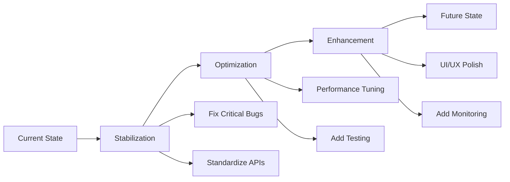

# Brownfield ERP System - Product Requirements Document
## 既有系統現代化產品需求文件

---

## Executive Summary | 執行摘要

This PRD documents the requirements for modernizing the existing ERP system, addressing technical debt, fixing integration issues, and establishing a sustainable development path forward. The system currently has a partially implemented Vue.js 3 frontend and Flask backend with various integration challenges that need systematic resolution.

本PRD記錄了現代化既有ERP系統的需求，解決技術債務、修復整合問題，並建立可持續的開發路徑。系統目前有部分實現的Vue.js 3前端和Flask後端，存在各種需要系統性解決的整合挑戰。

---

## Current State Assessment | 現況評估

### System Overview
- **Frontend**: Vue.js 3 with Element Plus UI library
- **Backend**: Flask with SQLAlchemy ORM
- **Database**: PostgreSQL with partial schema implementation
- **Authentication**: JWT with refresh token mechanism (has issues)
- **Current Status**: MVP with critical bugs in production

### Known Issues | 已知問題

#### Critical (P0)
1. **Authentication Failures (401 errors)**
   - Axios interceptor not properly adding Authorization headers
   - Pinia store initialization issues
   - Router navigation errors after login

2. **API Integration Issues**
   - Inconsistent error handling across endpoints
   - Missing CORS configuration for some routes
   - Database enum type conflicts

3. **Data Consistency Problems**
   - Missing foreign key constraints
   - Orphaned records in junction tables
   - Incomplete transaction rollback handling

#### High Priority (P1)
1. **Performance Issues**
   - N+1 query problems in supplier and requisition modules
   - Missing database indexes on frequently queried columns
   - No caching strategy implemented

2. **UI/UX Inconsistencies**
   - Component styling variations
   - Missing loading states
   - Incomplete error feedback to users

3. **Testing Gaps**
   - <30% unit test coverage
   - No integration tests
   - Missing E2E test suite

---

## Modernization Requirements | 現代化需求

### Phase 1: Stabilization (Weeks 1-4)

#### REQ-BF-001: Fix Authentication System
**Priority**: P0  
**Story Points**: 21

**Current State**:
- JWT tokens not consistently attached to requests
- Session management fails on page refresh
- Multiple authentication paths causing conflicts

**Target State**:
- Unified authentication flow
- Persistent session management
- Automatic token refresh without user disruption

**Acceptance Criteria**:
- [ ] All API calls include proper Authorization headers
- [ ] Token refresh works seamlessly
- [ ] No 401 errors during normal operation
- [ ] Session persists across page refreshes

**Technical Approach**:
```javascript
// Fix axios interceptor
api.interceptors.request.use(
  (config) => {
    const token = localStorage.getItem('auth_token');
    if (token) {
      config.headers.Authorization = `Bearer ${token}`;
    }
    return config;
  }
);
```

#### REQ-BF-002: Standardize API Error Handling
**Priority**: P0  
**Story Points**: 13

**Current State**:
- Inconsistent error response formats
- Missing error codes
- No centralized error handling

**Target State**:
- Standardized error response format
- Comprehensive error code system
- Global error handler with user feedback

**Implementation**:
```python
# Standardized error response
{
    "error": {
        "code": "VALIDATION_ERROR",
        "message": "User-friendly message",
        "details": {
            "field": "specific_error"
        }
    },
    "timestamp": "2025-09-09T10:00:00Z"
}
```

### Phase 2: Optimization (Weeks 5-8)

#### REQ-BF-003: Database Performance Optimization
**Priority**: P1  
**Story Points**: 21

**Requirements**:
- Add missing indexes
- Optimize slow queries
- Implement query result caching
- Fix N+1 query problems

**Metrics**:
- API response time <500ms for 95th percentile
- Database query time <100ms for common operations
- Cache hit rate >80% for reference data

#### REQ-BF-004: Implement Comprehensive Testing
**Priority**: P1  
**Story Points**: 34

**Coverage Targets**:
- Unit tests: >80% code coverage
- Integration tests: All API endpoints
- E2E tests: Critical user journeys

**Test Categories**:
1. **Unit Tests**
   - Component logic
   - Service methods
   - Utility functions

2. **Integration Tests**
   - API endpoint validation
   - Database operations
   - Authentication flow

3. **E2E Tests**
   - Complete requisition flow
   - Purchase order creation
   - Inventory management

### Phase 3: Enhancement (Weeks 9-12)

#### REQ-BF-005: UI/UX Standardization
**Priority**: P2  
**Story Points**: 21

**Requirements**:
- Create design system documentation
- Standardize component library
- Implement consistent loading states
- Add comprehensive error handling UI

#### REQ-BF-006: Monitoring & Observability
**Priority**: P2  
**Story Points**: 13

**Requirements**:
- Application performance monitoring
- Error tracking and alerting
- User behavior analytics
- System health dashboard

---

## Technical Debt Register | 技術債務登記

### High Impact Items

| ID | Component | Issue | Impact | Effort | Priority |
|----|-----------|-------|--------|--------|----------|
| TD-001 | Auth | Hardcoded secrets in code | Security risk | 5 | P0 |
| TD-002 | Database | Missing migrations | Deployment issues | 8 | P0 |
| TD-003 | API | No rate limiting | DDoS vulnerability | 13 | P1 |
| TD-004 | Frontend | Bundle size >5MB | Slow load times | 8 | P1 |
| TD-005 | Backend | Synchronous processing | Poor scalability | 21 | P2 |

---

## Migration Strategy | 遷移策略

### Approach: Incremental Modernization



### Risk Mitigation

1. **Feature Flags**: Enable gradual rollout
2. **Parallel Running**: Keep old system available
3. **Rollback Plan**: Quick revert capability
4. **Data Backup**: Hourly backups during migration

---

## Success Criteria | 成功標準

### Quantitative Metrics
- **System Stability**: <1% error rate
- **Performance**: 90% of requests <500ms
- **Test Coverage**: >80% code coverage
- **Uptime**: 99.5% availability
- **User Satisfaction**: >4.0/5.0 rating

### Qualitative Goals
- Clean, maintainable codebase
- Comprehensive documentation
- Consistent user experience
- Developer productivity improvement
- Reduced maintenance burden

---

## Dependencies | 依賴關係

### External Dependencies
- PostgreSQL 15+ for JSON support
- Redis for caching layer
- Docker for containerization
- GitHub Actions for CI/CD

### Internal Dependencies
- Completion of authentication fixes before API work
- Database optimization before performance testing
- API standardization before frontend refactoring

---

## Timeline | 時程表

```
Week 1-2:  Authentication & Critical Bug Fixes
Week 3-4:  API Standardization & Error Handling
Week 5-6:  Database Optimization & Indexing
Week 7-8:  Testing Implementation
Week 9-10: UI/UX Standardization
Week 11-12: Monitoring & Documentation
```

---

## Budget Considerations | 預算考量

### Development Resources
- 2 Full-stack developers × 12 weeks
- 1 QA engineer × 8 weeks
- 1 DevOps engineer × 4 weeks

### Infrastructure Costs
- Additional staging environment: $500/month
- Monitoring tools: $200/month
- Testing infrastructure: $300/month

### Total Estimated Cost: $80,000

---

## Appendix | 附錄

### A. Current System Architecture
- Frontend: Vue.js 3.x with Composition API
- State Management: Pinia
- UI Library: Element Plus
- Backend: Flask 2.x
- ORM: SQLAlchemy
- Database: PostgreSQL 15
- Authentication: JWT with Flask-JWT-Extended

### B. File Structure
```
project_ERP_dev_agent/
├── frontend/
│   ├── src/
│   │   ├── api/        # API integration layer (needs fixing)
│   │   ├── components/ # Reusable components
│   │   ├── views/      # Page components
│   │   └── stores/     # Pinia stores
├── backend/
│   ├── app.py          # Main application
│   ├── models.py       # Database models
│   └── routes/         # API endpoints
└── database/
    └── migrations/     # Database migrations (incomplete)
```

### C. Critical Code Sections Requiring Attention
1. `frontend/src/api/index.ts` - Axios interceptor configuration
2. `frontend/src/stores/auth.ts` - Authentication state management
3. `backend/app.py` - CORS and error handling middleware
4. `backend/models.py` - Database enum definitions

---

*Document Version: 1.0*  
*Last Updated: September 2025*  
*Status: Active Development*