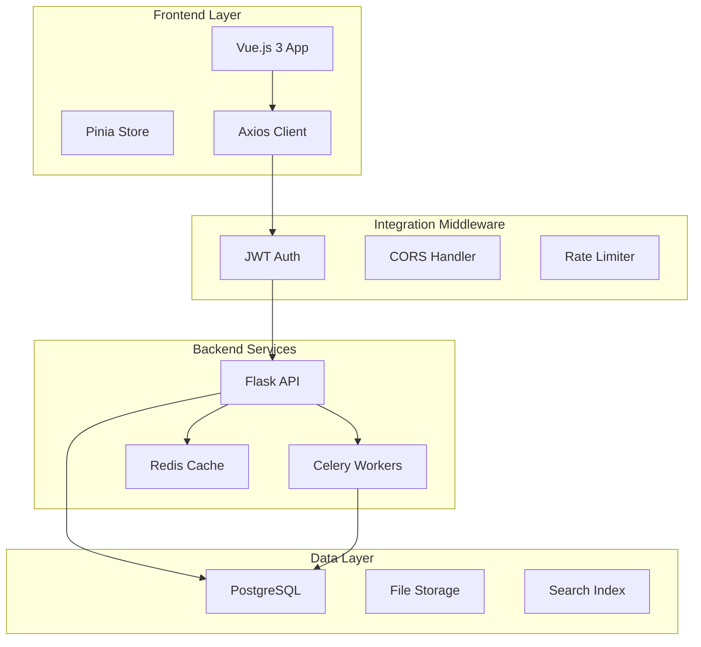
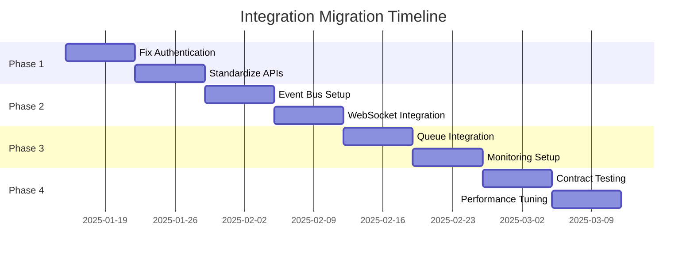

# ERP System Integration Architecture
## 整合架構文件

---

## Executive Summary | 執行摘要

This document defines the integration architecture for modernizing the existing ERP system, focusing on seamless API integration, data consistency, and system interoperability while maintaining backward compatibility during the brownfield transformation.

本文件定義了現代化既有ERP系統的整合架構，重點在於無縫API整合、資料一致性和系統互操作性，同時在棕地轉型期間保持向後兼容性。

---

## Integration Landscape | 整合概況

### Current State Integration Points



---

## API Integration Strategy | API整合策略

### RESTful API Standards

#### Endpoint Patterns
```
GET    /api/v1/{resource}          # List resources
GET    /api/v1/{resource}/{id}      # Get single resource
POST   /api/v1/{resource}           # Create resource
PUT    /api/v1/{resource}/{id}      # Update resource
DELETE /api/v1/{resource}/{id}      # Delete resource
```

#### Authentication Flow
```javascript
// Frontend Integration
const api = axios.create({
  baseURL: process.env.VUE_APP_API_URL || 'http://localhost:5000/api/v1',
  timeout: 30000,
  headers: {
    'Content-Type': 'application/json'
  }
});

// Token Interceptor
api.interceptors.request.use(
  (config) => {
    const token = localStorage.getItem('auth_token');
    if (token) {
      config.headers.Authorization = `Bearer ${token}`;
    }
    return config;
  },
  (error) => Promise.reject(error)
);

// Response Interceptor
api.interceptors.response.use(
  (response) => response,
  async (error) => {
    if (error.response?.status === 401) {
      const refreshToken = localStorage.getItem('refresh_token');
      if (refreshToken) {
        try {
          const { data } = await api.post('/auth/refresh', {
            refresh_token: refreshToken
          });
          localStorage.setItem('auth_token', data.access_token);
          error.config.headers.Authorization = `Bearer ${data.access_token}`;
          return api.request(error.config);
        } catch {
          localStorage.clear();
          window.location.href = '/login';
        }
      }
    }
    return Promise.reject(error);
  }
);
```

### Backend Integration Layer

```python
# Flask Integration Middleware
from flask import Flask, jsonify
from flask_cors import CORS
from flask_jwt_extended import JWTManager
from flask_limiter import Limiter
from flask_sqlalchemy import SQLAlchemy

class IntegrationMiddleware:
    def __init__(self, app: Flask):
        self.app = app
        self.setup_cors()
        self.setup_auth()
        self.setup_rate_limiting()
        self.setup_error_handlers()
    
    def setup_cors(self):
        CORS(self.app, origins=[
            'http://localhost:3000',
            'http://localhost:5173',
            'https://erp.company.com'
        ])
    
    def setup_auth(self):
        self.jwt = JWTManager(self.app)
        
        @self.jwt.expired_token_loader
        def expired_token_callback(jwt_header, jwt_payload):
            return jsonify({
                'error': {
                    'code': 'TOKEN_EXPIRED',
                    'message': 'Token has expired'
                }
            }), 401
    
    def setup_rate_limiting(self):
        self.limiter = Limiter(
            self.app,
            key_func=lambda: get_jwt_identity() or get_remote_address(),
            default_limits=["1000 per hour"]
        )
    
    def setup_error_handlers(self):
        @self.app.errorhandler(400)
        def bad_request(e):
            return jsonify({
                'error': {
                    'code': 'BAD_REQUEST',
                    'message': str(e)
                }
            }), 400
        
        @self.app.errorhandler(500)
        def internal_error(e):
            return jsonify({
                'error': {
                    'code': 'INTERNAL_ERROR',
                    'message': 'An internal error occurred'
                }
            }), 500
```

---

## Data Integration Patterns | 資料整合模式

### Event-Driven Integration

```python
# Event Bus Implementation
from dataclasses import dataclass
from typing import Dict, Any, List, Callable
from datetime import datetime
import json
import redis

@dataclass
class IntegrationEvent:
    event_type: str
    entity_type: str
    entity_id: str
    data: Dict[str, Any]
    timestamp: datetime
    correlation_id: str

class EventBus:
    def __init__(self, redis_client: redis.Redis):
        self.redis = redis_client
        self.handlers: Dict[str, List[Callable]] = {}
    
    def publish(self, event: IntegrationEvent):
        """Publish event to Redis pub/sub"""
        channel = f"integration:{event.entity_type}:{event.event_type}"
        message = json.dumps({
            'event_type': event.event_type,
            'entity_type': event.entity_type,
            'entity_id': event.entity_id,
            'data': event.data,
            'timestamp': event.timestamp.isoformat(),
            'correlation_id': event.correlation_id
        })
        self.redis.publish(channel, message)
    
    def subscribe(self, pattern: str, handler: Callable):
        """Subscribe to event patterns"""
        if pattern not in self.handlers:
            self.handlers[pattern] = []
        self.handlers[pattern].append(handler)

# Usage Example
event_bus = EventBus(redis_client)

# Publish requisition approved event
event_bus.publish(IntegrationEvent(
    event_type='approved',
    entity_type='requisition',
    entity_id='REQ-2025-001',
    data={'approved_by': 'manager@company.com'},
    timestamp=datetime.now(),
    correlation_id='corr-123'
))
```

### Database Integration

```python
# Transaction Coordination
from contextlib import contextmanager
from sqlalchemy import create_engine
from sqlalchemy.orm import sessionmaker

class DatabaseIntegrator:
    def __init__(self, connection_string: str):
        self.engine = create_engine(connection_string)
        self.Session = sessionmaker(bind=self.engine)
    
    @contextmanager
    def transaction(self):
        """Managed transaction context"""
        session = self.Session()
        try:
            yield session
            session.commit()
        except Exception as e:
            session.rollback()
            raise IntegrationError(f"Transaction failed: {str(e)}")
        finally:
            session.close()
    
    def sync_entities(self, source_entity, target_entity):
        """Synchronize entities across systems"""
        with self.transaction() as session:
            # Map source fields to target
            mapping = self.get_field_mapping(source_entity, target_entity)
            
            for source_field, target_field in mapping.items():
                setattr(target_entity, target_field, 
                       getattr(source_entity, source_field))
            
            session.add(target_entity)
            
            # Publish integration event
            self.publish_sync_event(source_entity, target_entity)
```

---

## Module Integration Matrix | 模組整合矩陣

| Source Module | Target Module | Integration Type | Protocol | Frequency |
|--------------|---------------|-----------------|----------|-----------|
| Requisition | Procurement | Event-driven | REST/WebSocket | Real-time |
| Procurement | Inventory | Transactional | REST API | On-demand |
| Inventory | Accounting | Batch | REST API | Daily |
| Storage | Inventory | Real-time | WebSocket | Real-time |
| Projects | Requisition | Reference | REST API | On-demand |
| Receiving | Storage | Event-driven | REST/Queue | Real-time |
| Acceptance | Accounting | Workflow | REST API | On-trigger |
| Lead Time | Procurement | Analytics | REST API | Hourly |

---

## Integration Security | 整合安全性

### API Security Layers

```python
# Security Middleware Stack
from functools import wraps
from flask_jwt_extended import verify_jwt_in_request, get_jwt_identity
import hashlib
import hmac

class SecurityIntegration:
    @staticmethod
    def require_api_key(f):
        """API key validation decorator"""
        @wraps(f)
        def decorated(*args, **kwargs):
            api_key = request.headers.get('X-API-Key')
            if not api_key or not validate_api_key(api_key):
                return jsonify({'error': 'Invalid API key'}), 401
            return f(*args, **kwargs)
        return decorated
    
    @staticmethod
    def validate_hmac_signature(f):
        """HMAC signature validation"""
        @wraps(f)
        def decorated(*args, **kwargs):
            signature = request.headers.get('X-Signature')
            timestamp = request.headers.get('X-Timestamp')
            
            if not signature or not timestamp:
                return jsonify({'error': 'Missing signature'}), 401
            
            # Validate timestamp (prevent replay attacks)
            if abs(time.time() - float(timestamp)) > 300:  # 5 minutes
                return jsonify({'error': 'Request expired'}), 401
            
            # Validate HMAC
            expected = hmac.new(
                app.config['SECRET_KEY'].encode(),
                f"{timestamp}{request.data.decode()}".encode(),
                hashlib.sha256
            ).hexdigest()
            
            if not hmac.compare_digest(signature, expected):
                return jsonify({'error': 'Invalid signature'}), 401
            
            return f(*args, **kwargs)
        return decorated
```

---

## Message Queue Integration | 訊息佇列整合

### Celery Task Integration

```python
# Asynchronous Task Processing
from celery import Celery
from celery.result import AsyncResult

class TaskIntegration:
    def __init__(self, broker_url: str, backend_url: str):
        self.celery = Celery('erp_tasks',
                           broker=broker_url,
                           backend=backend_url)
        self.setup_tasks()
    
    def setup_tasks(self):
        @self.celery.task(bind=True, max_retries=3)
        def process_approval_workflow(self, requisition_id: str):
            """Process approval workflow asynchronously"""
            try:
                # Fetch requisition
                requisition = fetch_requisition(requisition_id)
                
                # Check approval rules
                approval_chain = get_approval_chain(requisition)
                
                # Send notifications
                for approver in approval_chain:
                    send_approval_notification(approver, requisition)
                
                # Update status
                update_requisition_status(requisition_id, 'pending_approval')
                
                return {'status': 'success', 'requisition_id': requisition_id}
            
            except Exception as exc:
                # Retry with exponential backoff
                raise self.retry(exc=exc, countdown=2 ** self.request.retries)
        
        @self.celery.task
        def sync_inventory_levels():
            """Periodic inventory synchronization"""
            with DatabaseIntegrator() as db:
                inventory_items = db.query(InventoryItem).all()
                
                for item in inventory_items:
                    # Calculate actual vs system quantity
                    actual = calculate_actual_quantity(item)
                    
                    if abs(item.quantity - actual) > item.tolerance:
                        # Create adjustment record
                        adjustment = InventoryAdjustment(
                            item_id=item.id,
                            old_quantity=item.quantity,
                            new_quantity=actual,
                            reason='System synchronization'
                        )
                        db.add(adjustment)
                        
                        # Update item quantity
                        item.quantity = actual
                
                db.commit()
```

---

## WebSocket Integration | WebSocket整合

### Real-time Communication

```javascript
// Frontend WebSocket Integration
import { io, Socket } from 'socket.io-client';

class WebSocketIntegration {
  private socket: Socket;
  private handlers: Map<string, Function[]> = new Map();
  
  constructor(url: string) {
    this.socket = io(url, {
      auth: {
        token: localStorage.getItem('auth_token')
      },
      reconnection: true,
      reconnectionDelay: 1000,
      reconnectionAttempts: 5
    });
    
    this.setupEventHandlers();
  }
  
  private setupEventHandlers() {
    this.socket.on('connect', () => {
      console.log('WebSocket connected');
      this.emit('user:subscribe', { 
        channels: ['requisitions', 'approvals', 'inventory'] 
      });
    });
    
    this.socket.on('requisition:updated', (data) => {
      this.trigger('requisition:updated', data);
    });
    
    this.socket.on('approval:required', (data) => {
      this.trigger('approval:required', data);
    });
    
    this.socket.on('inventory:low_stock', (data) => {
      this.trigger('inventory:low_stock', data);
    });
  }
  
  public on(event: string, handler: Function) {
    if (!this.handlers.has(event)) {
      this.handlers.set(event, []);
    }
    this.handlers.get(event)!.push(handler);
  }
  
  private trigger(event: string, data: any) {
    const handlers = this.handlers.get(event) || [];
    handlers.forEach(handler => handler(data));
  }
  
  public emit(event: string, data: any) {
    this.socket.emit(event, data);
  }
}

// Usage in Vue component
export default {
  setup() {
    const ws = new WebSocketIntegration('ws://localhost:5000');
    
    ws.on('requisition:updated', (data) => {
      // Update local state
      updateRequisition(data);
      
      // Show notification
      ElNotification({
        title: 'Requisition Updated',
        message: `Requisition ${data.id} has been ${data.status}`,
        type: 'info'
      });
    });
    
    return { ws };
  }
};
```

---

## Integration Testing Strategy | 整合測試策略

### Contract Testing

```python
# API Contract Tests
import pytest
from jsonschema import validate

class IntegrationContractTests:
    @pytest.fixture
    def api_client(self):
        """Test API client with authentication"""
        client = TestClient(app)
        token = self.get_test_token()
        client.headers['Authorization'] = f'Bearer {token}'
        return client
    
    def test_requisition_approval_contract(self, api_client):
        """Test requisition approval API contract"""
        # Arrange
        requisition_schema = {
            "type": "object",
            "required": ["id", "status", "items", "total_amount"],
            "properties": {
                "id": {"type": "string"},
                "status": {"enum": ["draft", "pending", "approved", "rejected"]},
                "items": {
                    "type": "array",
                    "items": {
                        "type": "object",
                        "required": ["product_id", "quantity", "unit_price"],
                        "properties": {
                            "product_id": {"type": "string"},
                            "quantity": {"type": "number"},
                            "unit_price": {"type": "number"}
                        }
                    }
                },
                "total_amount": {"type": "number"}
            }
        }
        
        # Act
        response = api_client.post('/api/v1/requisitions/REQ-001/approve')
        
        # Assert
        assert response.status_code == 200
        validate(response.json(), requisition_schema)
    
    def test_inventory_sync_integration(self, api_client):
        """Test inventory synchronization integration"""
        # Arrange
        initial_inventory = api_client.get('/api/v1/inventory').json()
        
        # Act - Create purchase order
        po_response = api_client.post('/api/v1/purchase-orders', json={
            'supplier_id': 'SUP-001',
            'items': [
                {'product_id': 'PROD-001', 'quantity': 100}
            ]
        })
        
        # Act - Receive goods
        receive_response = api_client.post(
            f'/api/v1/receiving/{po_response.json()["id"]}/receive',
            json={'received_items': [{'product_id': 'PROD-001', 'quantity': 100}]}
        )
        
        # Assert - Verify inventory updated
        final_inventory = api_client.get('/api/v1/inventory').json()
        product = next(i for i in final_inventory if i['product_id'] == 'PROD-001')
        
        assert product['quantity'] == initial_inventory[0]['quantity'] + 100
```

---

## Integration Monitoring | 整合監控

### Health Check Endpoints

```python
# System Health Monitoring
from flask import Blueprint
import psutil
import redis

health_bp = Blueprint('health', __name__)

@health_bp.route('/health/integration', methods=['GET'])
def integration_health():
    """Check all integration points"""
    health_status = {
        'status': 'healthy',
        'timestamp': datetime.now().isoformat(),
        'integrations': {}
    }
    
    # Check database
    try:
        db.session.execute('SELECT 1')
        health_status['integrations']['database'] = 'healthy'
    except:
        health_status['integrations']['database'] = 'unhealthy'
        health_status['status'] = 'degraded'
    
    # Check Redis
    try:
        redis_client.ping()
        health_status['integrations']['redis'] = 'healthy'
    except:
        health_status['integrations']['redis'] = 'unhealthy'
        health_status['status'] = 'degraded'
    
    # Check external APIs
    external_apis = ['supplier_api', 'payment_gateway', 'shipping_provider']
    for api in external_apis:
        try:
            response = requests.get(f"{API_ENDPOINTS[api]}/health", timeout=5)
            health_status['integrations'][api] = 'healthy' if response.ok else 'unhealthy'
        except:
            health_status['integrations'][api] = 'unhealthy'
            health_status['status'] = 'degraded'
    
    # System metrics
    health_status['metrics'] = {
        'cpu_percent': psutil.cpu_percent(),
        'memory_percent': psutil.virtual_memory().percent,
        'disk_usage': psutil.disk_usage('/').percent,
        'active_connections': len(active_connections),
        'queue_depth': redis_client.llen('task_queue')
    }
    
    status_code = 200 if health_status['status'] == 'healthy' else 503
    return jsonify(health_status), status_code
```

---

## Migration Strategy | 遷移策略

### Phased Integration Approach



### Rollback Procedures

```python
# Feature Flag Integration
class FeatureFlagIntegration:
    def __init__(self):
        self.flags = {
            'new_authentication': False,
            'event_driven_updates': False,
            'websocket_notifications': False,
            'async_processing': False
        }
    
    def is_enabled(self, feature: str) -> bool:
        """Check if integration feature is enabled"""
        return self.flags.get(feature, False)
    
    def toggle(self, feature: str, enabled: bool):
        """Toggle integration feature"""
        if feature in self.flags:
            self.flags[feature] = enabled
            # Log change
            logger.info(f"Feature {feature} {'enabled' if enabled else 'disabled'}")
            # Update config in database
            update_feature_flag(feature, enabled)

# Usage
feature_flags = FeatureFlagIntegration()

@app.route('/api/v1/requisitions/<id>/approve', methods=['POST'])
def approve_requisition(id):
    if feature_flags.is_enabled('event_driven_updates'):
        # New event-driven approach
        event_bus.publish(ApprovalEvent(requisition_id=id))
    else:
        # Legacy synchronous approach
        process_approval_synchronously(id)
```

---

## Performance Optimization | 效能優化

### Caching Strategy

```python
# Multi-level Caching
from functools import lru_cache
import redis
import pickle

class IntegrationCache:
    def __init__(self, redis_client: redis.Redis):
        self.redis = redis_client
        self.local_cache = {}
        self.ttl = {
            'user_permissions': 300,  # 5 minutes
            'product_catalog': 3600,  # 1 hour
            'exchange_rates': 86400,  # 1 day
        }
    
    def get(self, key: str, fetch_func=None):
        """Get from cache with fallback"""
        # L1: Local memory cache
        if key in self.local_cache:
            return self.local_cache[key]
        
        # L2: Redis cache
        redis_value = self.redis.get(f"cache:{key}")
        if redis_value:
            value = pickle.loads(redis_value)
            self.local_cache[key] = value
            return value
        
        # L3: Fetch from source
        if fetch_func:
            value = fetch_func()
            self.set(key, value)
            return value
        
        return None
    
    def set(self, key: str, value: any):
        """Set cache value"""
        # Store in local cache
        self.local_cache[key] = value
        
        # Store in Redis with TTL
        ttl = self.ttl.get(key.split(':')[0], 600)
        self.redis.setex(
            f"cache:{key}",
            ttl,
            pickle.dumps(value)
        )
    
    def invalidate(self, pattern: str):
        """Invalidate cache by pattern"""
        # Clear local cache
        keys_to_remove = [k for k in self.local_cache if pattern in k]
        for key in keys_to_remove:
            del self.local_cache[key]
        
        # Clear Redis cache
        for key in self.redis.scan_iter(f"cache:{pattern}*"):
            self.redis.delete(key)
```

---

## Disaster Recovery | 災難復原

### Integration Backup Strategy

```python
# Integration State Backup
class IntegrationBackup:
    def backup_integration_state(self):
        """Backup all integration configurations"""
        backup_data = {
            'timestamp': datetime.now().isoformat(),
            'api_keys': self.backup_api_keys(),
            'webhooks': self.backup_webhooks(),
            'event_subscriptions': self.backup_event_subscriptions(),
            'feature_flags': self.backup_feature_flags(),
            'cache_state': self.backup_cache_state()
        }
        
        # Store backup
        with open(f'backup_{datetime.now().strftime("%Y%m%d_%H%M%S")}.json', 'w') as f:
            json.dump(backup_data, f, indent=2)
        
        # Upload to S3
        s3_client.upload_file(
            f.name,
            'erp-backups',
            f'integration/{f.name}'
        )
    
    def restore_integration_state(self, backup_file: str):
        """Restore integration configuration from backup"""
        with open(backup_file, 'r') as f:
            backup_data = json.load(f)
        
        # Restore in order
        self.restore_api_keys(backup_data['api_keys'])
        self.restore_webhooks(backup_data['webhooks'])
        self.restore_event_subscriptions(backup_data['event_subscriptions'])
        self.restore_feature_flags(backup_data['feature_flags'])
        
        logger.info(f"Integration state restored from {backup_data['timestamp']}")
```

---

## Compliance & Audit | 合規性與稽核

### Integration Audit Trail

```python
# Audit Logging for Integrations
class IntegrationAudit:
    def log_integration_event(self, event_type: str, details: dict):
        """Log integration events for audit"""
        audit_entry = {
            'timestamp': datetime.now().isoformat(),
            'event_type': event_type,
            'user': get_current_user(),
            'ip_address': request.remote_addr,
            'details': details,
            'correlation_id': generate_correlation_id()
        }
        
        # Store in database
        db.session.add(IntegrationAuditLog(**audit_entry))
        db.session.commit()
        
        # Send to SIEM if configured
        if app.config.get('SIEM_ENABLED'):
            send_to_siem(audit_entry)
    
    @staticmethod
    def audit_api_call(f):
        """Decorator for API audit logging"""
        @wraps(f)
        def decorated(*args, **kwargs):
            start_time = time.time()
            
            # Log request
            IntegrationAudit().log_integration_event('api_request', {
                'endpoint': request.endpoint,
                'method': request.method,
                'args': request.args.to_dict(),
                'body_size': len(request.data)
            })
            
            # Execute function
            result = f(*args, **kwargs)
            
            # Log response
            IntegrationAudit().log_integration_event('api_response', {
                'endpoint': request.endpoint,
                'status_code': result[1] if isinstance(result, tuple) else 200,
                'duration_ms': (time.time() - start_time) * 1000
            })
            
            return result
        return decorated
```

---

## Integration Best Practices | 整合最佳實踐

### Guidelines

1. **API Versioning**: Always version APIs and maintain backward compatibility
2. **Idempotency**: Ensure all write operations are idempotent
3. **Circuit Breakers**: Implement circuit breakers for external service calls
4. **Rate Limiting**: Apply rate limits to prevent abuse
5. **Monitoring**: Comprehensive monitoring of all integration points
6. **Documentation**: Keep integration documentation up-to-date
7. **Testing**: Maintain contract tests for all integrations
8. **Security**: Use encryption for data in transit and at rest
9. **Error Handling**: Implement graceful degradation
10. **Audit Trail**: Maintain complete audit logs

---

## Conclusion | 結論

This integration architecture provides a robust foundation for the ERP system modernization, ensuring reliable communication between components while maintaining system stability during the brownfield transformation. The phased approach allows for incremental improvements with minimal disruption to existing operations.

此整合架構為ERP系統現代化提供了穩固的基礎，確保組件之間可靠的通信，同時在棕地轉型期間保持系統穩定性。分階段的方法允許漸進式改進，對現有運營的干擾最小。

---

*Document Version: 1.0*  
*Last Updated: September 2025*  
*Architecture Status: Implementation Ready*